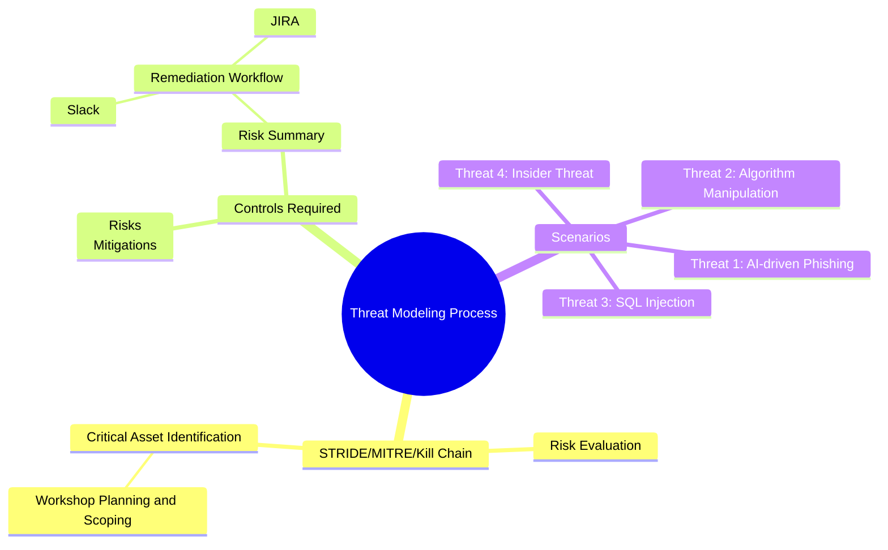

# AI Threat Modeling Workshop Summary

## **Introduction**
This workshop was conducted to identify potential threats and vulnerabilities targeting **AlpinePay**, the flagship fintech application developed by **Alpine FinTech Solutions**. The session aimed to enhance the application's security posture by incorporating threat modeling into its development lifecycle, ensuring early identification of risks and mitigation strategies.

## **Attendees**
The workshop included participation from:
- AlpinePay Engineering Team
- Product Managers
- DevEx Engineers
- DevSecOps Team

## **Scope**
Four threat scenarios were evaluated during the workshop:
1. **AI-driven phishing using advanced multi-channel and deepfake techniques**:
   - Attackers leverage generative AI to create highly personalized and convincing phishing emails. These emails may mimic trusted sources or ongoing business contexts to increase the likelihood of user engagement.
   - Enhanced techniques, such as voice deepfakes, may be used to impersonate executives or trusted colleagues in spear-phishing attacks.
   - Multi-channel phishing (email, SMS, and social media) amplifies the campaign's reach and success rate.

2. **Manipulation of automated trading algorithms.**
3. **SQL injection attack** exploiting API vulnerabilities.
4. **Insider threat** involving the theft of proprietary AI models.

## **Methodology**
The following frameworks and tools were utilized during the workshop:
- **Cyber Kill Chain**: To map the attack progression for each scenario.
- **MITRE ATT&CK Framework**: To analyze tactics, techniques, and procedures (TTPs).
- **STRIDE Framework**: To identify and assess control gaps and vulnerabilities.

## **Findings**
A total of **5 high-risk** and **2 medium-risk** threats were identified. These risks highlight critical security concerns that must be addressed to safeguard sensitive data, proprietary algorithms, and the application's infrastructure.

## **Controls Required**
To mitigate the identified risks, the following controls are recommended:

1. **Regular Security Audits**:
   - Perform periodic vulnerability assessments and penetration tests.
   - Focus on critical systems such as APIs, authentication mechanisms, and data storage.

2. **Enhanced Patch Management**:
   - Automate the patching process for third-party libraries and dependencies.
   - Maintain a robust inventory of all software components to prioritize high-risk patches.

3. **Comprehensive Phishing Awareness Training**:
   - Provide simulated phishing exercises to employees.
   - Establish clear procedures for reporting suspicious emails.

4. **Web Application Firewall (WAF):**
   - Deploy a cloud-based WAF to inspect and filter web traffic.
   - Continuously update WAF rules to defend against evolving threats.

5. **Multi-Factor Authentication (MFA):**
   - Enforce MFA across all user and administrative accounts.
   - Integrate biometric authentication for additional security.

6. **Passwordless Authentication (Alternative to MFA):**
   - Implement passwordless controls such as device-based authentication using FIDO2/WebAuthn.
   - Use biometric authentication or hardware security keys to enhance usability and security.
   - Ensure fallback mechanisms and recovery processes are in place for lost devices or credentials.

7. **Continuous Network Monitoring:**
   - Implement an Intrusion Detection and Prevention System (IDPS) to identify anomalies.
   - Use machine learning-based tools for real-time threat detection.

8. **Role-Based Access Control (RBAC):**
   - Regularly review and update role assignments to reflect organizational changes.
   - Implement the principle of least privilege to restrict access to sensitive resources.

9. **Incident Response Plan:**
   - Develop and test a comprehensive incident response plan.
   - Ensure alignment with industry best practices like NIST Cybersecurity Framework.

10. **Data Encryption:**
   - Apply end-to-end encryption for sensitive data in transit and at rest.
   - Use modern encryption standards such as AES-256 for securing critical data.

## **Conclusion**
This workshop has laid the foundation for a proactive and robust security posture for AlpinePay by identifying vulnerabilities and establishing actionable controls. Moving forward, the focus will remain on:
- Strengthening DevSecOps practices to "shift security left."
- Conducting regular threat modeling workshops to anticipate and mitigate new threats.
- Ensuring ongoing training for all team members on security best practices.

The collaboration across teams demonstrates Alpine FinTech Solutions' commitment to delivering a secure and resilient fintech application to its users.

## **Threat Modeling Process Summary**


```
