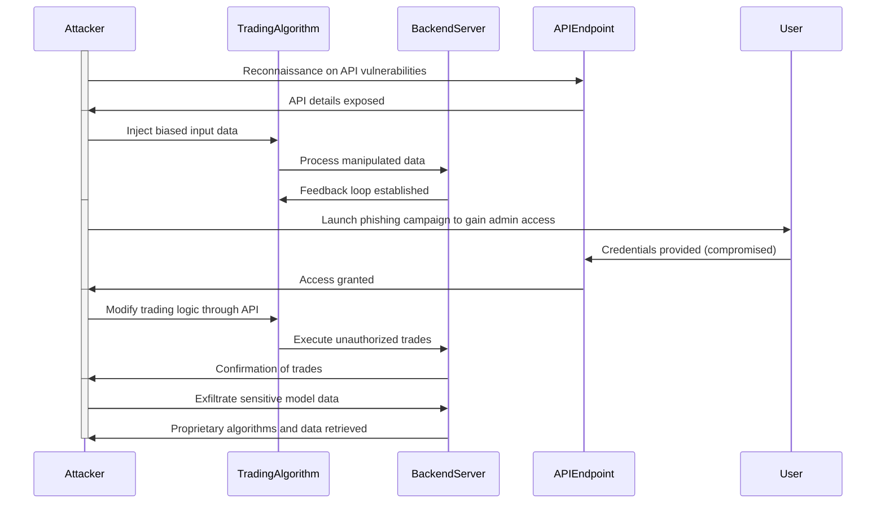

```mermaid
sequenceDiagram
    participant Attacker
    participant TradingAlgorithm
    participant BackendServer
    participant APIEndpoint
    participant User

    activate Attacker
    Attacker->>APIEndpoint: Reconnaissance on API vulnerabilities
    APIEndpoint->>Attacker: API details exposed
    deactivate Attacker

    activate Attacker
    Attacker->>TradingAlgorithm: Inject biased input data
    TradingAlgorithm->>BackendServer: Process manipulated data
    BackendServer->>TradingAlgorithm: Feedback loop established
    deactivate Attacker

    activate Attacker
    Attacker->>User: Launch phishing campaign to gain admin access
    User->>APIEndpoint: Credentials provided (compromised)
    APIEndpoint->>Attacker: Access granted
    deactivate Attacker

    activate Attacker
    Attacker->>TradingAlgorithm: Modify trading logic through API
    TradingAlgorithm->>BackendServer: Execute unauthorized trades
    BackendServer->>Attacker: Confirmation of trades
    deactivate Attacker

    activate Attacker
    Attacker->>BackendServer: Exfiltrate sensitive model data
    BackendServer->>Attacker: Proprietary algorithms and data retrieved
    deactivate Attacker
```
