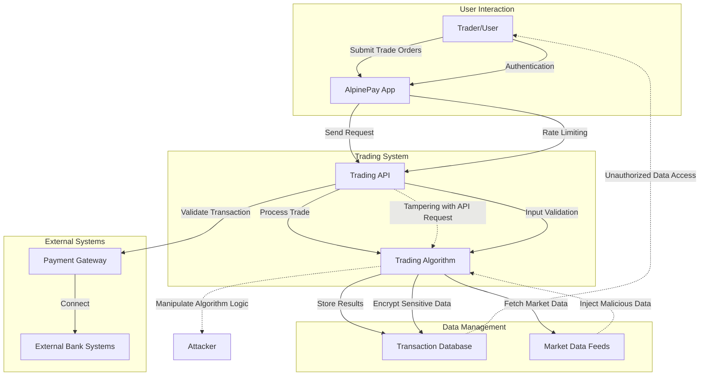

```mermaid
flowchart TD
    subgraph "User Interaction"
        User[Trader/User] -->|Submit Trade Orders| App[AlpinePay App]
    end

    subgraph "Trading System"
        App -->|Send Request| API[Trading API]
        API -->|Process Trade| Algo[Trading Algorithm]
    end

    subgraph "Data Management"
        Algo -->|Store Results| DB[Transaction Database]
        Algo -->|Fetch Market Data| Market[Market Data Feeds]
    end

    subgraph "External Systems"
        API -->|Validate Transaction| Gateway[Payment Gateway]
        Gateway -->|Connect| Bank[External Bank Systems]
    end

    %% Threat Points
    API -.->|Tampering with API Request| Algo
    Market -.->|Inject Malicious Data| Algo
    DB -.->|Unauthorized Data Access| User
    Algo -.->|Manipulate Algorithm Logic| Attacker

    %% Controls
    Algo -->|Encrypt Sensitive Data| DB
    API -->|Input Validation| Algo
    User -->|Authentication| App
    App -->|Rate Limiting| API
```
