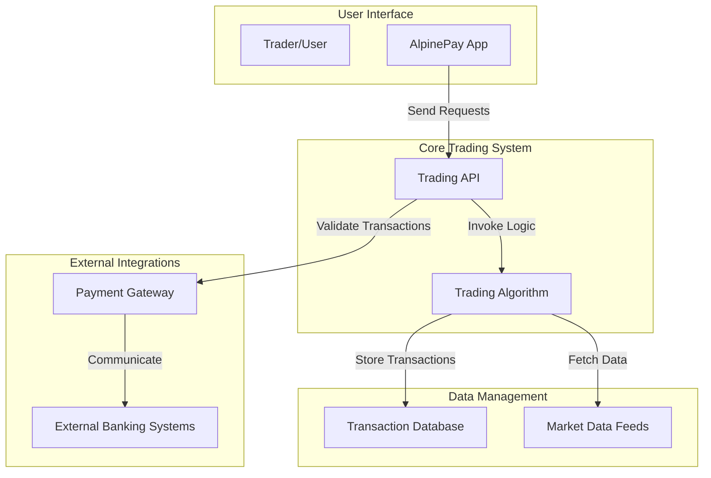

```mermaid
flowchart TD
    subgraph "User Interface"
        User[Trader/User]
        App[AlpinePay App]
    end

    subgraph "Core Trading System"
        App -->|Send Requests| API[Trading API]
        API -->|Invoke Logic| Algo[Trading Algorithm]
    end

    subgraph "Data Management"
        Algo -->|Store Transactions| DB[Transaction Database]
        Algo -->|Fetch Data| Market[Market Data Feeds]
    end

    subgraph "External Integrations"
        API -->|Validate Transactions| Gateway[Payment Gateway]
        Gateway -->|Communicate| Bank[External Banking Systems]
    end
```
